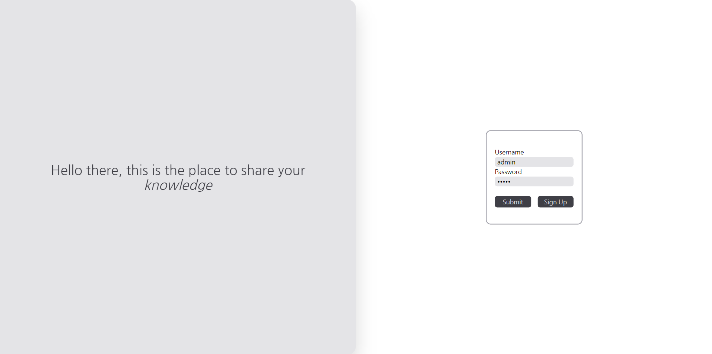
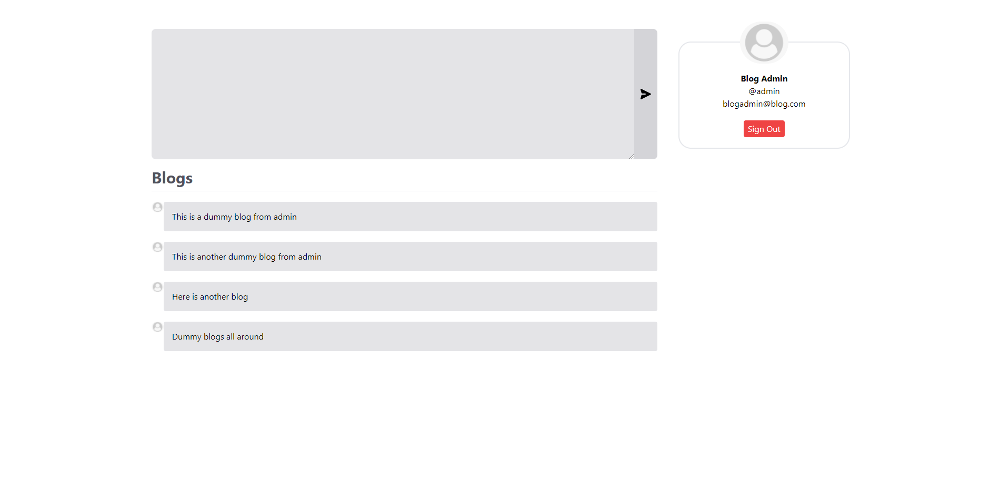

# Blogging Website

Blogging website built with react, typescript and tailwindcss on the frontend and flask on the backend with a sqlite relational database. Allows user to add blogs and read blogs from other people.

# Screenshots




# Building from source

To run the UI development server on localhost:3000

```
cd src/ui
npm start
```

To run the API server on localhost:5000

```
pip install -r requirements.txt
cd src/api
python3 main.py
```

(NOTE: Python 3.10.2 was used during development. Should work with lower versions of python.)

